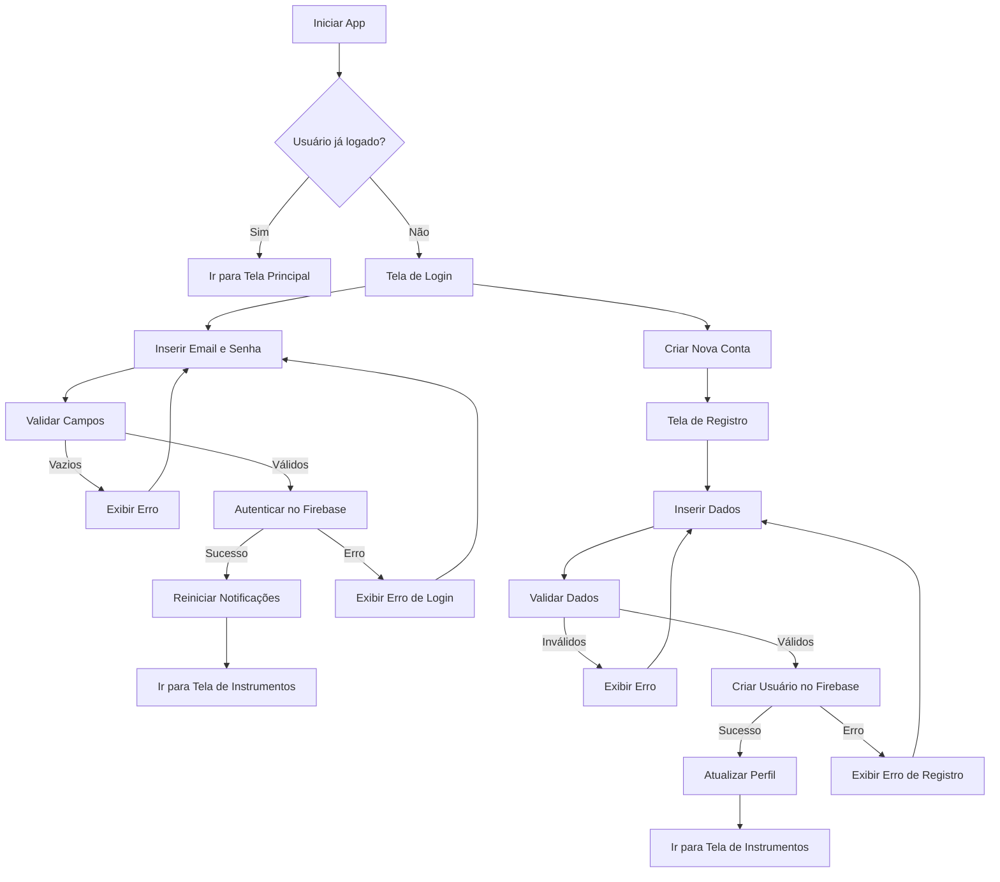
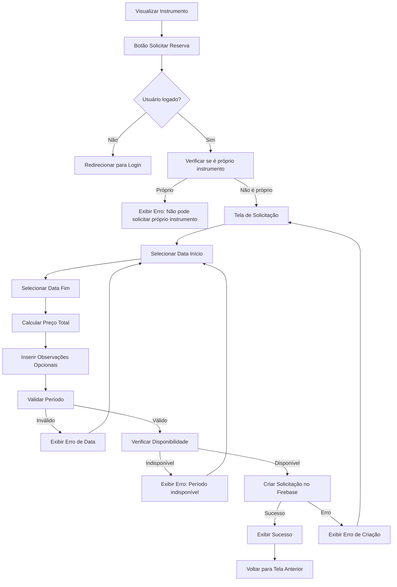
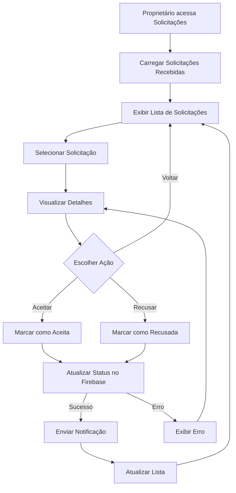
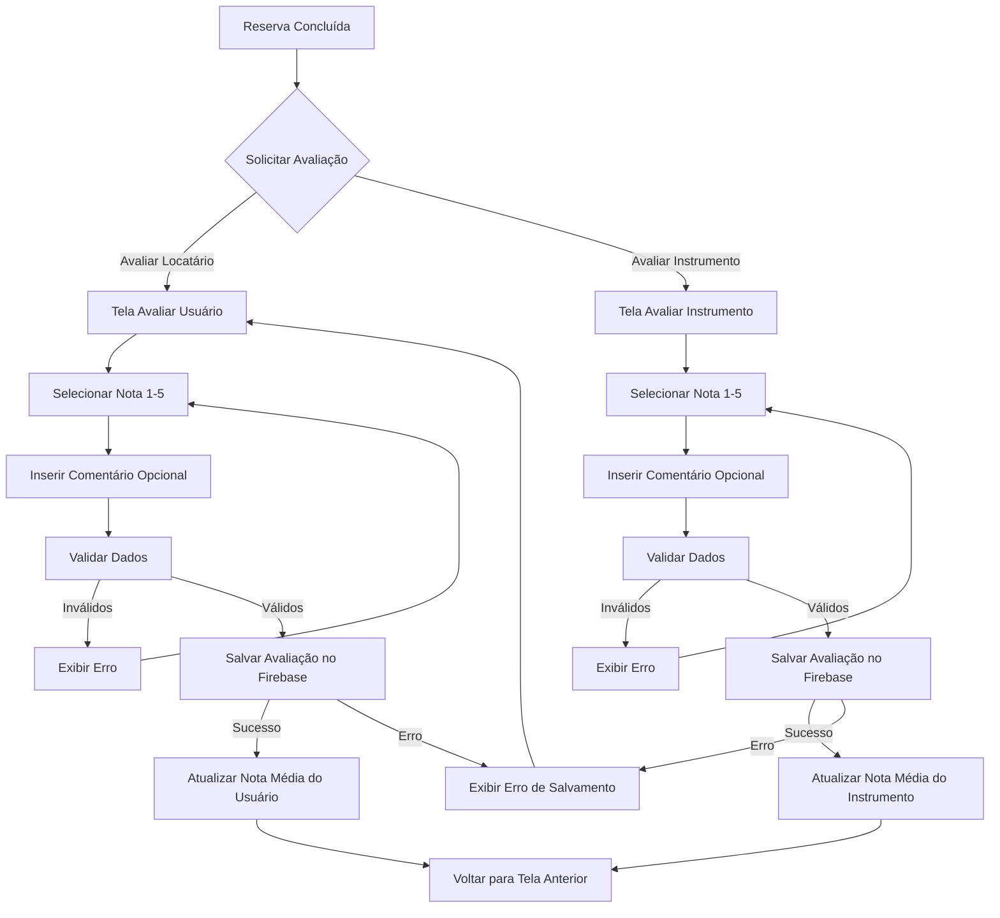
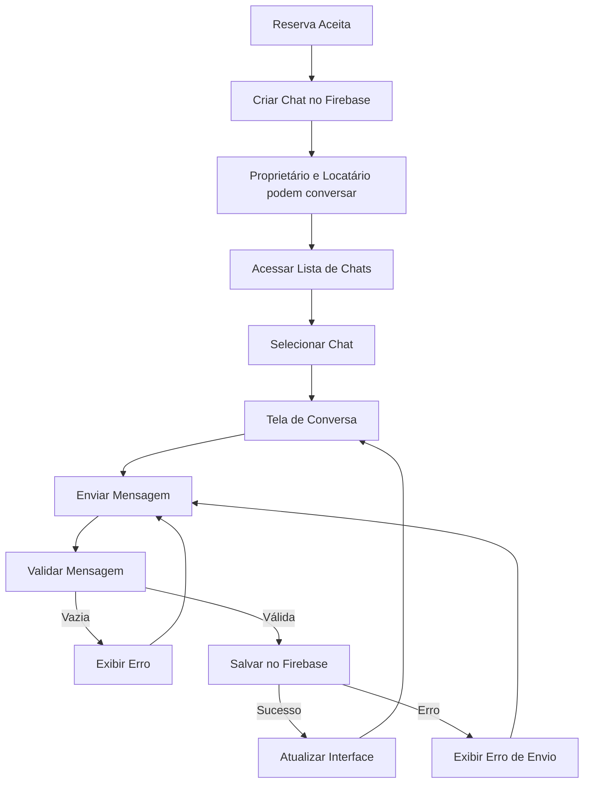
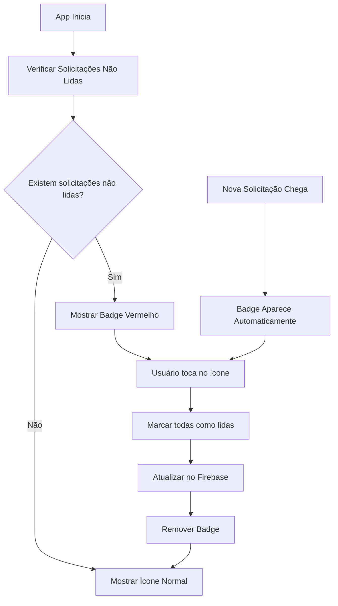
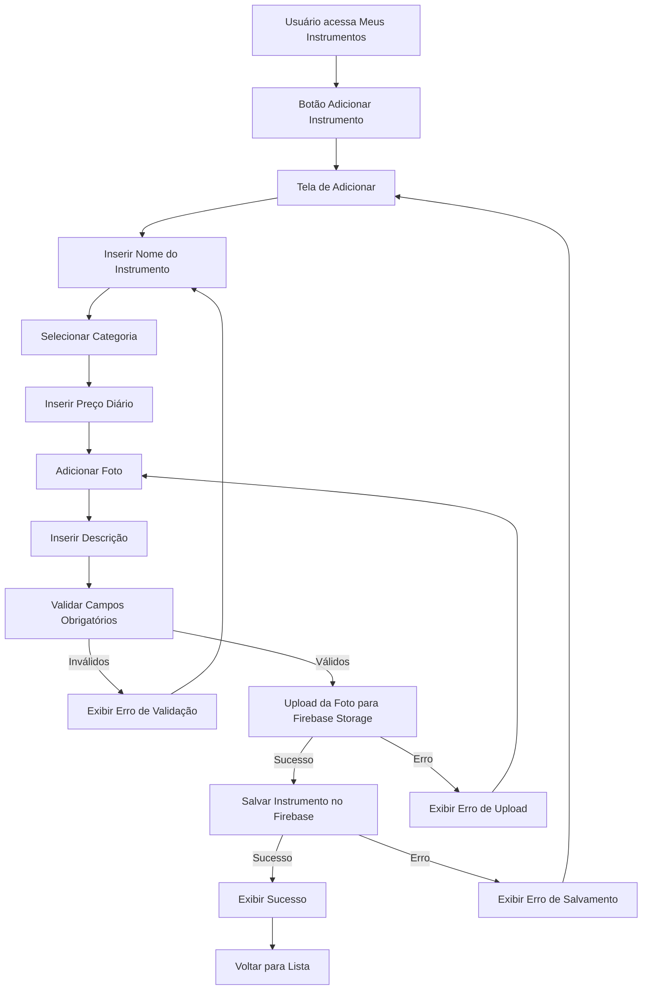
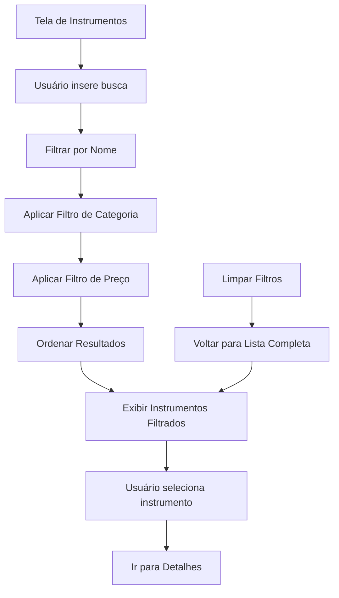
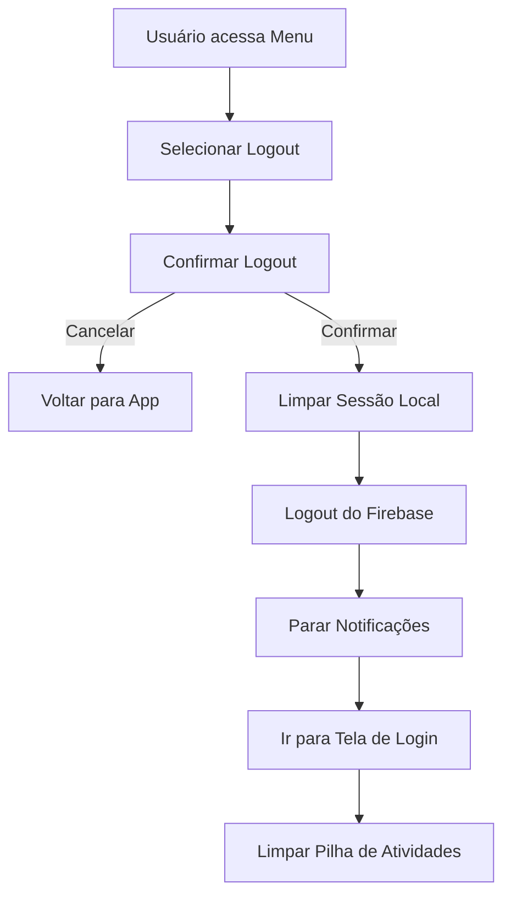
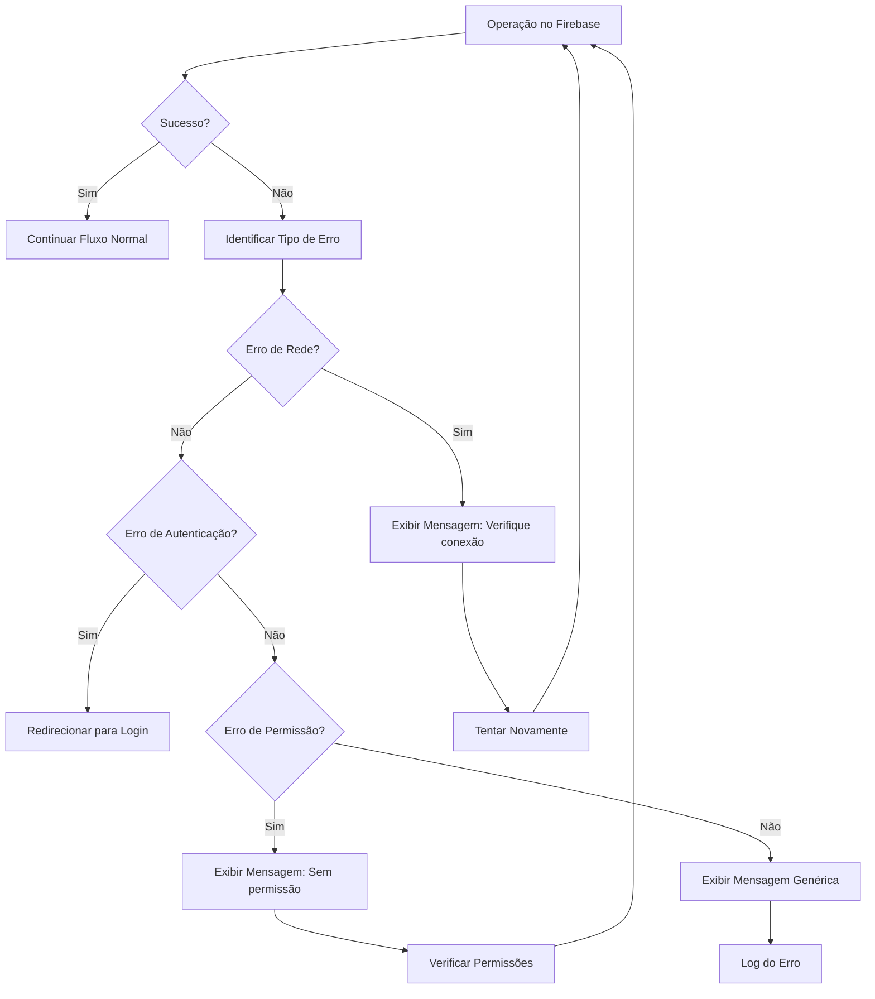

# Diagramas de Atividade - Sistema Instrumentaliza

## 1. Fluxo Principal de Autenticação

## 2. Fluxo de Solicitação de Reserva

## 3. Fluxo de Gerenciamento de Solicitações

## 4. Fluxo de Avaliação

## 5. Fluxo de Chat/Mensagens

## 6. Fluxo de Gerenciamento de Badge de Notificações

## 7. Fluxo de Adicionar Instrumento

## 8. Fluxo de Busca e Filtros

## 9. Fluxo de Logout

## 10. Fluxo de Recuperação de Erros

---

## Resumo dos Principais Fluxos

### **Fluxos de Usuário:**
1. **Autenticação** - Login/Registro
2. **Busca** - Encontrar instrumentos
3. **Solicitação** - Reservar instrumento
4. **Chat** - Comunicação
5. **Avaliação** - Feedback mútuo

### **Fluxos de Proprietário:**
1. **Gerenciamento** - Adicionar/Editar instrumentos
2. **Solicitações** - Aceitar/Recusar reservas
3. **Notificações** - Badge de alertas
4. **Avaliação** - Avaliar locatários

### **Fluxos do Sistema:**
1. **Notificações** - Push notifications
2. **Sincronização** - Firebase realtime
3. **Validação** - Dados e permissões
4. **Recuperação** - Tratamento de erros
